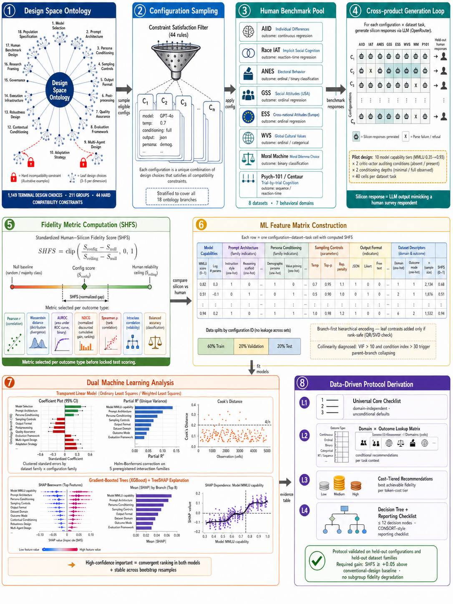
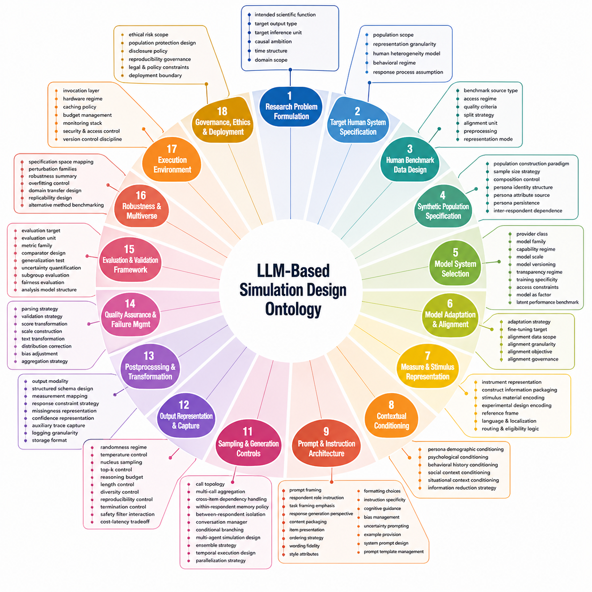
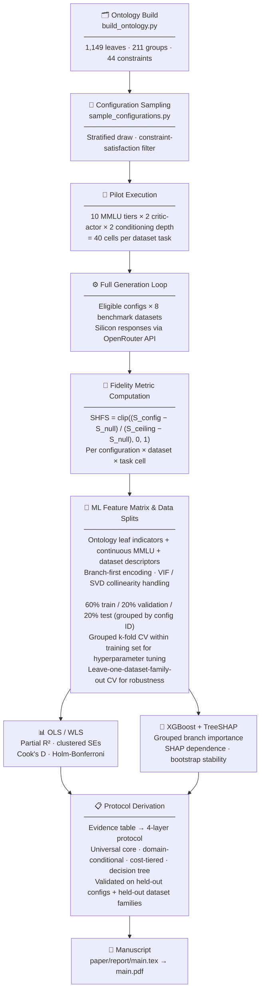

<div align="center">

# A Data-Driven Protocol for LLM-Based Simulation of Human Behavior

### An ontology-grounded, multi-dataset empirical study of silicon-human fidelity determinants

**Stijn Van Severen**
*Ghent University, Ghent, Belgium*

[](paper/report/main.tex)
[](src/preregistration/osf/osf_preregistration.md)
[](docker/)
[](LICENSE)

---

</div>

## 📋 Table of Contents

- [📝 Abstract](#-abstract)
- [📊 Methodology Overview](#-methodology-overview)
- [🧬 Ontology Overview](#-ontology-overview)
- [🔑 Primary Results at a Glance](#-primary-results-at-a-glance)
- [📌 Key Anticipated Contributions](#-key-anticipated-contributions)
- [📄 Full Paper](#-full-paper)
- [🗂️ Repository Structure](#️-repository-structure)
- [🛠️ Setup and Installation](#️-setup-and-installation)
- [🚀 Usage](#-usage)
- [🧬 Pipeline Overview](#-pipeline-overview)
- [📦 Outputs](#-outputs)
- [🔬 Methodological Notes](#-methodological-notes)
- [📚 Citation](#-citation)
- [⚖️ License](#️-license)

---

## 📝 Abstract

Large language models (LLMs) are increasingly used to simulate human behavioral data, yet researchers face hundreds of undocumented design choices that may substantially affect whether generated data resembles real human responses. This study introduces a machine-readable, 1,149-leaf ontology of LLM simulation design dimensions, encodes the full combinatorial state space of eligible design configurations, and uses a multi-dataset empirical design protocol to estimate which choices explain the largest variance in silicon-human fidelity. A stratified sample of eligible configurations will be applied to a diverse pool of open-access human datasets spanning individual differences, implicit social cognition, political behavior, general social attitudes, cross-cultural values, moral dilemma choice, and trial-by-trial cognition. For each configuration-dataset cell, a standardized silicon-human fidelity score (SHFS) is computed from task-appropriate metrics and normalized against null baselines and human reliability ceilings. Two complementary machine-learning models (a transparent OLS/WLS linear model with explicit collinearity handling and an XGBoost model with TreeSHAP explanations) then identify stable, generalizable design features that predict fidelity across datasets and outcome types. From these analyses, a protocol for selecting, validating, and reporting LLM-based simulators of human behavioral data is empirically derived.

> **Status:** Pre-execution. Preregistration complete; pilot execution pending.

## 📊 Methodology Overview



An eight-stage pipeline applies a machine-readable ontology (1,149 design choices, 44 hard constraints) to sample eligible configurations, which are evaluated across eight benchmark datasets spanning seven behavioral domains. For each configuration-dataset-task cell, LLM-generated responses are compared to held-out human responses using the standardized silicon-human fidelity score (SHFS). The resulting feature matrix (ontology indicators, MMLU capability, dataset descriptors) is split 60/20/20 (train/validation/test) with grouped k-fold cross-validation. Two complementary models identify design features predicting fidelity: a transparent OLS/WLS linear model and an XGBoost ensemble with TreeSHAP. Evidence of convergence between both models yields a four-layer empirically validated protocol (universal core, domain-conditional rules, cost-tiered guidance, decision tree), validated on held-out configurations and dataset families.

---

## 🧬 Ontology Overview



The simulation design space is formalized as a machine-readable ontology of 1,149 leaf design choices organized across 18 top-level dimensions and 212 hierarchical groups. Each dimension covers a distinct stage of the simulation pipeline — from research problem formulation and model selection through prompt architecture, contextual conditioning, generation controls, and governance. Hard constraints (44 total) encode cross-tree incompatibilities, cardinality rules govern how many choices may be selected per group, and a constraint-aware sampler draws eligible configurations for empirical evaluation.

---

## 🔑 Primary Results at a Glance

> *This section will be populated after study execution. Placeholder figures are shown below.*

**Figure 1 — Ontology and configuration sampling overview**


*The 18-dimension, 1,123-leaf simulation design ontology and the distribution of eligible configurations sampled from it. Each node color represents a top-level design family; edge density reflects cross-tree compatibility constraints.*

---

**Figure 2 — SHFS heatmap across configurations and dataset families**


*Standardized silicon-human fidelity scores (SHFS) across all configuration-dataset cells. Rows are ontology-stratified configurations; columns are dataset-task strata. Cells in white indicate insufficient valid silicon responses.*

---

## 📌 Key Anticipated Contributions

- **Ontology:** A typed, machine-readable 1,123-leaf taxonomy of all design choices in LLM-based human-data simulation, with cardinality rules, cross-tree hard constraints, and a CLI sampler — the first artifact of its kind for this domain.
- **Protocol:** A preregistered, multi-dataset empirical study that treats design-choice fidelity as a multivariate regression problem across seven behavioral-data domains.
- **Analysis:** Dual-model explanatory approach — OLS variance decomposition for transparency and XGBoost+SHAP for nonlinear feature importance — with cross-validated stability checks and held-out dataset validation.
- **Output:** A data-driven design protocol in decision-tree and checklist form, validated on held-out configurations and dataset families, that researchers can apply to future silicon-human simulation studies.
- **Scope:** Results will clarify when silicon simulation is likely to approximate human-level fidelity and where its limitations remain, with explicit ethics and misuse constraints.

---

## 📄 Full Paper

| File | Description |
|------|-------------|
| [paper/report/main.pdf](paper/report/main.pdf) | Compiled manuscript PDF |
| [paper/report/main.tex](paper/report/main.tex) | LaTeX manuscript source |
| [paper/report/other/references.bib](paper/report/other/references.bib) | Bibliography database |

---

## 🗂️ Repository Structure

```text
research_paper_on_synthetic_generation_design/
├── README.md                            # this file
├── LICENSE                              # MIT license
├── Makefile                             # shortcuts for setup, validation, build
├── pyproject.toml                       # Python package metadata
├── .env                                 # local API keys (not committed)
├── config/
│   ├── pipeline.yaml                    # stage ordering and canonical paths
│   ├── protocol.yaml                    # study-level design parameters
│   └── search_queries.yaml              # optional search query presets
├── docker/
│   ├── docker-compose.yml               # compose service for workflow execution
│   └── Dockerfile                       # image definition
├── paper/
│   ├── assets/
│   │   ├── figures/                     # publication figures (generated)
│   │   └── tables/                      # manuscript tables (generated)
│   └── report/
│       ├── main.tex                     # LaTeX manuscript
│       ├── main.pdf                     # compiled output
│       └── other/references.bib         # bibliography
└── src/
    ├── data/
    │   ├── README.md                    # data staging guide and manual retrieval checklist
    │   ├── sources_manifest.json        # machine-readable source status and DOIs
    │   ├── raw/
    │   │   ├── aiid/                    # AIID confirmatory subset + source notes
    │   │   ├── project_implicit_demo/
    │   │   │   └── race_iat/            # Race IAT 2025 archive and codebooks
    │   │   ├── anes_cdf/                # ANES codebook; raw data: manual retrieval
    │   │   ├── gss/                     # GSS codebook; raw data: manual retrieval
    │   │   ├── ess/                     # ESS Zenodo metadata; raw data: browser download
    │   │   ├── wvs/                     # WVS retrieval notes; raw data: manual
    │   │   ├── moral_machine/           # Moral Machine docs + auxiliary files
    │   │   ├── psych101_centaur/        # Psych-101/Centaur dataset card
    │   │   └── model_benchmarks/        # Frozen MMLU pilot mapping + OpenRouter validation
    │   ├── interim/                     # preprocessed task-specific files (generated)
    │   └── processed/                   # locked analysis-ready files (generated)
    ├── ontologies/
    │   ├── README.md                    # ontology schema documentation
    │   ├── build_ontology.py            # declarative source-of-truth builder
    │   ├── ontology.json                # canonical artifact (1123 leaves, 209 groups, 39 constraints)
    │   ├── sample_configurations.py     # CLI sampler with subtree filtering
    │   └── samples/
    │       ├── pilot.txt                # 40 pilot design cells (10 MMLU × 2 critic × 2 conditioning)
    │       ├── eligible_samples.txt     # canonical 100-config smoke-test output
    │       └── minimal_smoke.txt        # 20-config end-to-end smoke test
    ├── preregistration/
    │   ├── osf/
    │   │   └── osf_preregistration.md   # single canonical preregistration document
    │   └── deviations.md                # log all deviations before analysis
    └── analysis/
        ├── run_pipeline.py              # analysis entrypoint scaffold
        ├── generate_figures.py
        └── generate_tables.py
```

---

## 🛠️ Setup and Installation

### Option A — Local

```bash
python3.11 -m venv .venv
source .venv/bin/activate
python -m pip install --upgrade pip
python -m pip install -e .
```

Add your OpenRouter API key:

```text
# .env
OPENROUTER_API_KEY=sk-or-v1-...
```

### Option B — Docker

```bash
docker compose -f docker/docker-compose.yml up --build
```

---

## 🚀 Usage

### Build the ontology

```bash
cd src/ontologies
python build_ontology.py
# → ontology.json (~1002 KB; 1149 leaves, 211 groups, 44 constraints)
```

### Sample eligible configurations

```bash
# Canonical conventional-core smoke test
python sample_configurations.py \
  --preset conventional_core \
  --mode sample \
  --max-samples 100 \
  --scan-limit 20000 \
  --seed 7 \
  --output samples/eligible_samples.txt

# List all group dot-ids (use as --include-subtree values)
python sample_configurations.py --list-subtrees

# Inspect leaves in a specific subtree
python sample_configurations.py \
  --include-subtree interaction_decomposition_and_orchestration.multi_agent_simulation_design \
  --list-leaves
```

### Compile the manuscript

```bash
make paper
```

---

## 🧬 Pipeline Overview



---

## 📦 Outputs

| File / Directory | Description |
|---|---|
| `src/ontologies/ontology.json` | Canonical simulation design ontology |
| `src/ontologies/samples/pilot.txt` | Complete pilot design (40 cells: 10 MMLU × 2 critic × 2 conditioning, all valid) |
| `src/ontologies/samples/eligible_samples.txt` | 100-config smoke-test sample |
| `src/preregistration/osf/osf_preregistration.md` | Full preregistration document (upload to OSF) |
| `src/preregistration/deviations.md` | Deviation log (update before any confirmatory analysis) |
| `src/data/raw/model_benchmarks/mmlu_pilot_model_mapping.csv` | Frozen 10-tier MMLU pilot model mapping |
| `src/data/sources_manifest.json` | Machine-readable dataset source status |
| `paper/report/main.pdf` | Compiled manuscript |
| `paper/assets/figures/` | Exported publication figures |
| `paper/assets/tables/` | Manuscript-ready LaTeX tables |

---

## 🔬 Methodological Notes

### Design Space

The simulation design space is encoded in `src/ontologies/ontology.json` as 18 top-level dimension groups (1,149 leaves, 211 groups, 44 hard cross-tree constraints, 5 named presets). The ontology's `meta` block defines the full algebra of sampling: variable types, cardinality modes, relation types, constraint classes, and incompatibility families. An eligible configuration is a leaf set that satisfies all hard constraints after recursive cardinality sampling.

### Dataset Pool

The study uses eight open-access human behavioral datasets spanning seven prediction-context families. For detailed data-staging status, source URLs, DOIs, and manual retrieval instructions see [`src/data/README.md`](src/data/README.md).

| Dataset | Domain | Data status | Access |
|---|---|---|---|
| AIID | Individual differences, social attitudes, identities, psychometrics | Confirmatory subset downloaded | [osf.io/pcjwf](https://osf.io/pcjwf/) — CC0 1.0 Universal |
| Project Implicit Race IAT | Implicit cognition, intergroup bias | 2025 archive and codebooks downloaded | [osf.io/52qxl](https://osf.io/52qxl/) — data-use agreement required |
| ANES CDF | Political behavior, elections | Codebook downloaded; **raw data: manual retrieval** | [electionstudies.org](https://electionstudies.org/data-center/anes-time-series-cumulative-data-file/) — free registration |
| GSS | US social attitudes and behavior | Codebook downloaded; **raw data: manual retrieval** | [gss.norc.org](https://gss.norc.org/content/norc/us/en/gss/get-the-data.html) — free registration |
| ESS | Cross-national European attitudes | Zenodo metadata downloaded; **raw `.dta`: browser download** | [doi.org/10.5281/zenodo.12799641](https://doi.org/10.5281/zenodo.12799641) — CC-BY 4.0 |
| WVS | Global values, culture, religion | **Manual retrieval required** | [worldvaluessurvey.org](https://www.worldvaluessurvey.org/WVSDocumentationWV7.jsp) — WVSA terms |
| Moral Machine | Moral dilemmas, cross-cultural ethics | Documentation downloaded; large archives deferred | [osf.io/3hvt2](https://osf.io/3hvt2/) — see OSF notes |
| Psych-101/Centaur | Trial-by-trial cognition | Dataset card downloaded; large files deferred | [huggingface.co/datasets/marcelbinz/psych-101](https://huggingface.co/datasets/marcelbinz/psych-101) |

### Pilot Design

The preregistered pilot varies three factors:

1. **Model capability (MMLU):** 10 target levels (0.35 → 0.93), mapped to distinct OpenRouter-accessible instruction-tuned models spanning weak small models to frontier.
2. **Critic-actor realism auditing:** absent vs. present (rubric-based, `max_iter = 1`).
3. **Conditioning depth:** minimal vs. full observed non-identifying conditioning.

**→ 10 × 2 × 2 = 40 pilot design cells per dataset task.** All 10 model IDs confirmed available via the OpenRouter API on 2026-04-25. See [`src/data/raw/model_benchmarks/mmlu_pilot_model_mapping.csv`](src/data/raw/model_benchmarks/mmlu_pilot_model_mapping.csv) for the frozen mapping and MMLU sources.

### Outcome Metric

The primary outcome is **SHFS** (standardized silicon-human fidelity score), computed per configuration-dataset-task cell:

```text
SHFS = clip( (S_config − S_null) / (S_ceiling − S_null),  0, 1 )
```

where `S_null` is the task-appropriate null baseline and `S_ceiling` is the estimated human reliability ceiling. For loss-like metrics the formula is sign-flipped before normalization.

### Analysis

Two preregistered ML approaches estimate which design features drive SHFS:

| Model | Role | Collinearity handling | Inference |
|---|---|---|---|
| OLS/WLS with branch-first estimation | Transparent direction + effect size | QR/SVD rank check, VIF > 10 / CI > 30 collapsing, Holm-Bonferroni for interactions, Cook's D diagnostics | Partial R², clustered SEs, commonality decomposition |
| XGBoost + TreeSHAP | Nonlinear importance, interaction capture | Same feature preprocessing as OLS | Mean absolute SHAP by ontology branch, interaction values, bootstrap stability |

### Deviations

Any change after preregistration that affects sampling, datasets, metrics, model selection, or primary analyses must be logged in [`src/preregistration/deviations.md`](src/preregistration/deviations.md) before analysis.

---

## 📚 Citation

```bibtex
@misc{vanseveren2026llmsim,
  title        = {A Data-Driven Protocol for {LLM}-Based Simulation of Human Behavior:
                  An Ontology-Grounded, Multi-Dataset Study of Silicon-Human Fidelity},
  author       = {Van Severen, Stijn},
  year         = {2026},
  institution  = {Ghent University},
  note         = {Preregistered study; preregistration available at
                  src/preregistration/osf/osf\_preregistration.md}
}
```

---

## ⚖️ License

The repository scaffold and ontology code are released under the [MIT License](LICENSE). Dataset files remain governed by their original source licenses and data-use terms. See [`src/data/README.md`](src/data/README.md) for per-source licensing notes.

---

## 📚 References

**Datasets**

Hussey, I., Hughes, S., Lai, C. K., Ebersole, C. R., Axt, J., & Nosek, B. A. (2012). *The Attitudes, Identities, and Individual Differences (AIID) Study and Dataset*. Open Science Framework. https://doi.org/10.17605/OSF.IO/PCJWF

Xu, K., Nosek, B. A., & Greenwald, A. G. (2014). Psychology data from the Race Implicit Association Test on the Project Implicit Demo website. *Journal of Open Psychology Data*, *2*(1), e3. https://doi.org/10.5334/jopd.ac

American National Election Studies. (2026). *ANES Time Series Cumulative Data File* (current release February 5, 2026). https://electionstudies.org/data-center/anes-time-series-cumulative-data-file/

NORC at the University of Chicago. (2026). *General Social Survey data and documentation*. https://gss.norc.org/content/norc/us/en/gss/get-the-data.html

Mentesoglu Tardivo, C. (2024). *European Social Survey Data Round 1–11 merged* [Data set]. Zenodo. https://doi.org/10.5281/zenodo.12799641

World Values Survey Association. (2022). *World Values Survey Wave 7 (2017–2022) Cross-National Data-Set* (Version 3.0.0). https://doi.org/10.14281/18241.17

Awad, E., Dsouza, S., Kim, R., Schulz, J., Henrich, J., Shariff, A., Bonnefon, J.-F., & Rahwan, I. (2018). The Moral Machine experiment. *Nature*, *563*, 59–64. https://doi.org/10.1038/s41586-018-0637-6

Binz, M., Akata, E., Bethge, M., et al. (2025). A foundation model to predict and capture human cognition. *Nature*, *644*, 1002–1009. https://doi.org/10.1038/s41586-025-09215-4

**Methods and related work**

Argyle, L. P., Busby, E. C., Fulda, N., Gubler, J. R., Rytting, C., & Wingate, D. (2023). Out of one, many: Using language models to simulate human samples. *Political Analysis*, *31*(3), 337–351. https://doi.org/10.1017/pan.2023.2

Bail, C. A. (2024). Can generative AI improve social science? *Proceedings of the National Academy of Sciences*, *121*(21), e2314021121. https://doi.org/10.1073/pnas.2314021121

Bisbee, J., Clinton, J. D., Dorff, C., Kenkel, B., & Larson, J. M. (2024). Synthetic replacements for human survey data? The perils of large language models. *Political Analysis*, *32*(4), 401–416. https://doi.org/10.1017/pan.2024.5

Cameron, A. C., & Miller, D. L. (2015). A practitioner's guide to cluster-robust inference. *Journal of Human Resources*, *50*(2), 317–372. https://doi.org/10.3368/jhr.50.2.317

Chen, T., & Guestrin, C. (2016). XGBoost: A scalable tree boosting system. *Proceedings of the 22nd ACM SIGKDD International Conference on Knowledge Discovery and Data Mining*, 785–794. https://doi.org/10.1145/2939672.2939785

Hendrycks, D., Burns, C., Basart, S., Zou, A., Mazeika, M., Song, D., & Steinhardt, J. (2021). Measuring massive multitask language understanding. *International Conference on Learning Representations*. https://arxiv.org/abs/2009.03300

Lundberg, S. M., & Lee, S.-I. (2017). A unified approach to interpreting model predictions. *Advances in Neural Information Processing Systems*, *30*, 4765–4774. https://proceedings.neurips.cc/paper_files/paper/2017/hash/8a20a8621978632d76c43dfd28b67767-Abstract.html

Lundberg, S. M., Erion, G., Chen, H., DeGrave, A., Prutkin, J. M., Nair, B., Katz, R., Himmelfarb, J., Bansal, N., & Lee, S.-I. (2020). From local explanations to global understanding with explainable AI for trees. *Nature Machine Intelligence*, *2*, 56–67. https://doi.org/10.1038/s42256-019-0138-9

Santurkar, S., Durmus, E., Ladhak, F., Lee, C., Liang, P., & Hashimoto, T. (2023). Whose opinions do language models reflect? *Proceedings of the 40th International Conference on Machine Learning*, 29971–30004. https://proceedings.mlr.press/v202/santurkar23a.html

Tjuatja, L., Chen, V., Wu, T., Talwalkwar, A., & Neubig, G. (2024). Do LLMs exhibit human-like response biases? A case study in survey research. *Transactions of the Association for Computational Linguistics*, *12*, 1011–1026. https://doi.org/10.1162/tacl_a_00685

Cummins, J. (2025). The threat of analytic flexibility in using large language models to simulate human data. *arXiv preprint* arXiv:2509.13397. https://doi.org/10.48550/arXiv.2509.13397
